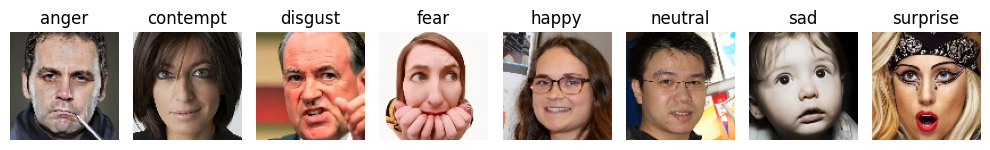

# Frugal Learning for Emotion Recognition

This project compares two approaches for emotion recognition:

1. **CNN on raw RGB images**
2. **MLP on facial landmarks / keypoints extracted from images**

The goal is to study whether landmark-based features can provide a more efficient alternative to image-based deep learning, with lower computational cost while keeping competitive accuracy.

## Motivation

Deep CNNs often achieve strong accuracy, but they require more computation, memory, longer inference time.
This project investigates a frugal-learning approach by replacing raw image input with compact landmark representations.

## Research Question

Can a landmark-based MLP model achieve competitive emotion-recognition performance compared with a CNN trained on raw images, while using less computational resources?

## Hypothesis

A model trained on extracted keypoints will be:

- faster to train
- smaller in size
- faster at inference
- comparably accurate (to CNN)

## Models

### 1. CNN

- Input: raw RGB images
- Output: 8 emotion classes

### 2. Landmark-Based MLP

- Input: facial landmarks / keypoints extracted from images by using MP Holistic
- Output: 8 emotion classes

## Dataset: AffectNet

**Total images in training set**: 16108

**Total images in test set**: 14518

**9 Classes:** 'anger', 'contempt', 'disgust', 'fear', 'happy', 'neutral', 'sad', 'surprise'



## Methodology

1. Load and preprocess images
2. Extract keypoints using MediaPipe Holistic
3. Train CNN on raw images
4. Train MLP on extracted keypoints
5. Compare:
   - accuracy
   - F1-score
   - training time
   - number of parameters
   - model size
6. Plots:
   - Accuracy vs Model Complexity (show efficiency trade-off)
   - Training Time Comparison (bar-chart)
   - Inference Time per Sample (bar-chart: time per image)
   - Accuracy and Loss Curves for both models
   - Confusion Matrix (show which emotions are confused)
   - Model Size Comparison (MB)
   - Frugality Plot (Resources vs Accuracy of both models)

## Project Structure

```bash
.
├── affectnet_dataset/
├── img/
├── model/
├── old_model/
├── saved_models/
├── scripts/
├── README.md
└── requirements.txt
└── rgb_dataset.ipynb
```
